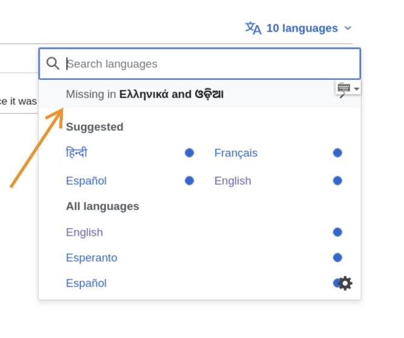
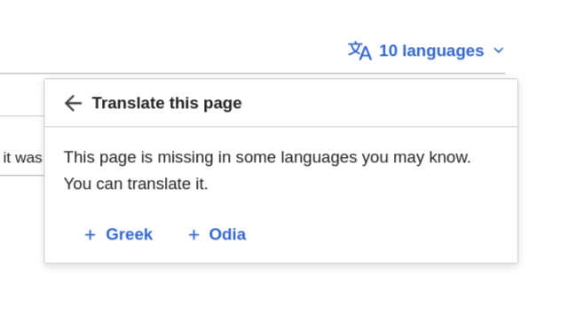
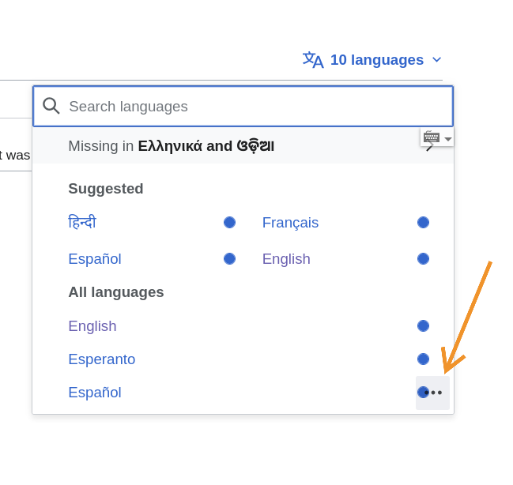
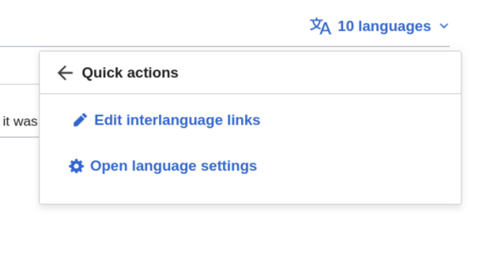
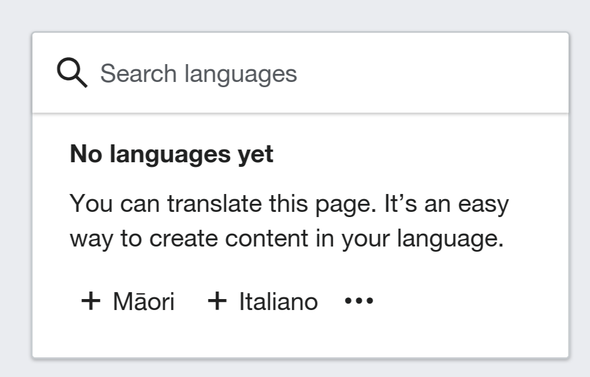
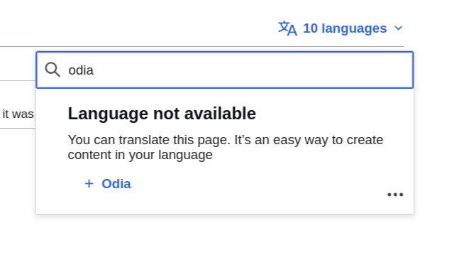

# Entry point registry

Extensions can register custom entry points (actions, links, or messages) in the Universal Language Selector (ULS) rewrite
interface using the `EntrypointRegistry`.

## Entry points

### Missing languages

The missing languages entry point is displayed in `content` mode when the selector is opened and there are suggested languages
that are not available in the current list of selectable languages.



When clicked, it opens a panel with specific actions:



### Quick action

Quick actions are displayed at the bottom of the language selector.



Clicking the trigger (ellipsis icon) opens the quick actions panel:



### Empty language list

Displayed when the list of selectable languages is entirely empty.



### Empty search list

Displayed when a user performs a search, but no results are found.



---

## Registering an entry point

To register an entry point, ensure your ResourceLoader module includes `ext.uls.rewrite.entrypoints` as a dependency.

Use the following pattern to register your entry point:

```javascript
const EntrypointRegistry = require('ext.uls.rewrite.entrypoints');
const {cdxIconSettings} = require("@wikimedia/codex-icons");
const {ENTRYPOINT_TYPE, ULS_MODE} = EntrypointRegistry;

EntrypointRegistry.register(
  ENTRYPOINT_TYPE.QUICK_ACTIONS,
  {
    id: 'my-extension-action', // Unique identifier for the entry point
    /** @param {Object} context contains: languages, suggestions, searchQuery, etc. */
    shouldShow: (context) => {
      // Return true if the entry point should be displayed.
      return true;
    },
    /** @param {Object} context */
    getConfig: (context) => {
      // Return a single object or an array of objects.
      return {
        label: 'My Action',
        icon: cdxIconSettings, // Codex icon
        // Use either handler (for JS actions) or url (for links)
        handler: () => {
          // Action to perform on click
        },
        // url: 'https://example.org'
      };
    }
  },
  // For what ULS mode should the entry point be displayed?
  [ULS_MODE.CONTENT, ULS_MODE.INTERFACE]
);
```

## The context object

The `context` object passed to `shouldShow` and `getConfig` provides state information from the ULS interface. Its contents vary depending on the entry point type:

### `QUICK_ACTIONS` and `EMPTY_SEARCH`

*   `languages`: (Array) List of language codes currently displayed in the selector.
*   `suggestions`: (Array) List of suggested language codes.
*   `searchQuery`: (string) The current text in the search input.
*   `searchQueryHits`: (Object) A map where keys are language codes and values are details about how the search query matched that language (e.g., matching name, code, or alias).

### `MISSING_CONTENT_LANGUAGES`

*   `languages`: (Object) A map of all selectable language codes to their autonyms.
*   `suggestions`: (Array) List of suggested language codes for the user.
*   `missingLanguages`: (Array) List of language codes that are in `suggestions` but are not available in the current `languages` map.

### `EMPTY_LIST`

*   `languages`: (Array) An empty array (as the list is empty).
*   `suggestions`: (Array) List of suggested language codes for the user.

---

### Important notes

*   **Timing:** Register entry points as early as possible, typically when your ResourceLoader module is evaluated. The registry is locked as soon as the first ULS component mounts. Any later registration attempt throws an error. This prevents entry points from appearing after initial render and causing layout shifts.
*   **Identification:** Each entry point must have a unique `id`. This is used for internal tracking and ensures that different
extensions do not overwrite each other's entry points.
*   **Entry point types (`ENTRYPOINT_TYPE`):**
    *   `QUICK_ACTIONS`: Small icons shown at the bottom of the language selector.
    *   `MISSING_CONTENT_LANGUAGES`: Shown in 'content' mode when suggested languages are missing from the list.
    *   `EMPTY_SEARCH`: Displayed when no results match the user's search.
    *   `EMPTY_LIST`: Displayed when the language list itself is empty.
*   **Modes (`ULS_MODE`):**
    *   `CONTENT`: Used when ULS is for selecting content language (e.g., in the sidebar).
    *   `INTERFACE`: Used when ULS is for selecting the user interface language.

---

## Example patches

*   [ULS rewrite: Add relevant missing languages entry point](https://gerrit.wikimedia.org/r/c/mediawiki/extensions/ContentTranslation/+/1270955)
*   [ULS rewrite: Add quick actions entry point](https://gerrit.wikimedia.org/r/c/mediawiki/extensions/ContentTranslation/+/1275344)
